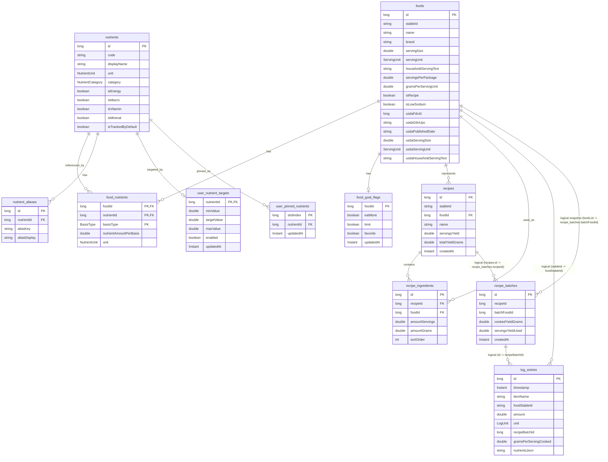
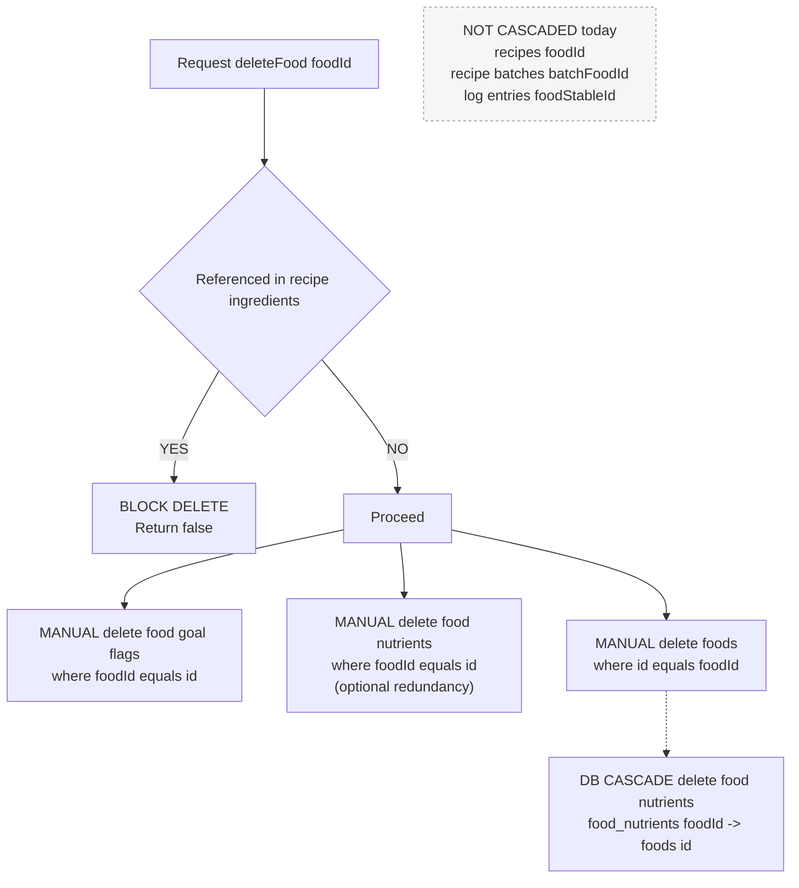
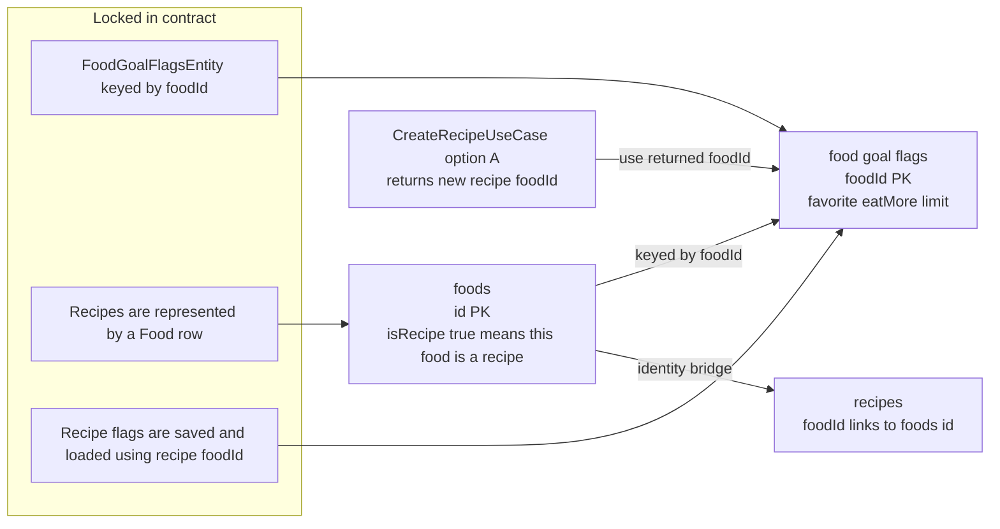
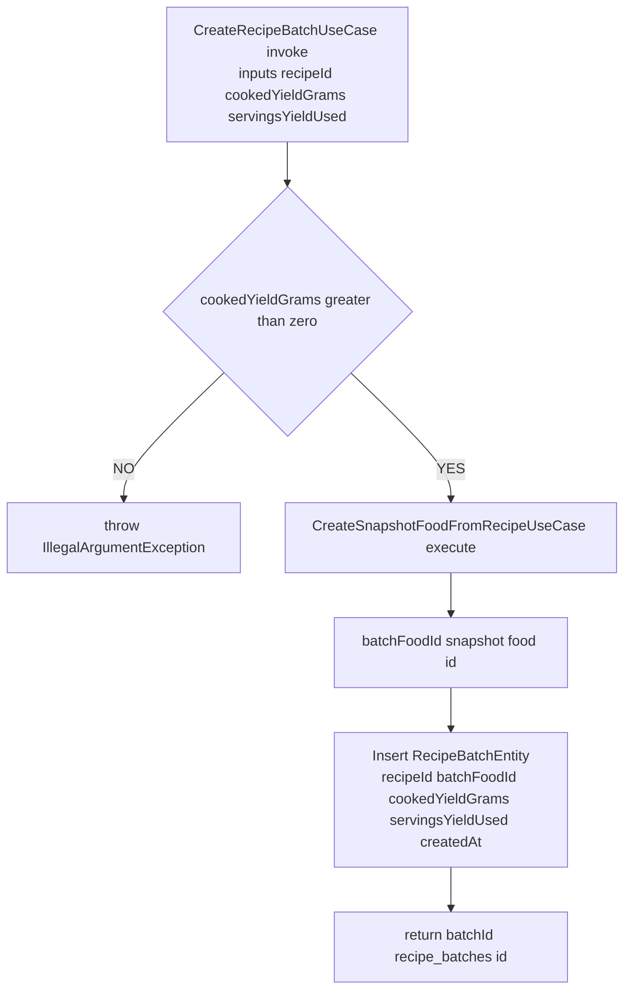
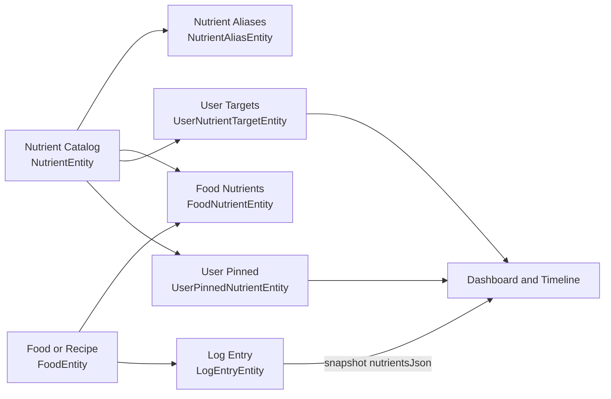

# Schema Diagrams (Mermaid)

## Canonical ERD

```mermaid
%% =====================================================================
%% AdobongKangkong – Consolidated Canonical ERD + Appendices (Mermaid)
%% Source-of-truth: Room @Entity files + NutriDatabase registration
%% Date: 2026-02-05
%% =====================================================================

%% ---------------------------------------------------------------------
%% 1) Canonical ERD (core schema)
%% ---------------------------------------------------------------------
erDiagram
    foods ||--o{ food_nutrients : has
    foods ||--o| food_goal_flags : has
    foods ||--o{ recipes : represents
    recipes ||--o{ recipe_ingredients : contains
    foods ||--o{ recipe_ingredients : used_as

    %% Nutrient catalog / aliasing / user settings
    nutrients ||--o{ food_nutrients : referenced_by
    nutrients ||--o{ nutrient_aliases : has
    nutrients ||--o| user_nutrient_targets : targeted_by
    nutrients ||--o{ user_pinned_nutrients : pinned_as

    %% Logging + batches (logical refs)
    foods ||--o{ log_entries : "logical (stableId -> foodStableId)"
    recipe_batches ||--o{ log_entries : "logical (id -> recipeBatchId)"
    recipes ||--o{ recipe_batches : "logical (recipes.id -> recipe_batches.recipeId)"
    foods ||--o{ recipe_batches : "logical snapshot (foods.id -> recipe_batches.batchFoodId)"

    foods {
        long id PK
        string stableId
        string name
        string brand
        double servingSize
        ServingUnit servingUnit
        string householdServingText
        double servingsPerPackage
        double gramsPerServingUnit
        boolean isRecipe
        boolean isLowSodium
        long usdaFdcId
        string usdaGtinUpc
        string usdaPublishedDate
        double usdaServingSize
        ServingUnit usdaServingUnit
        string usdaHouseholdServingText
    }

    food_goal_flags {
        long foodId PK
        boolean eatMore
        boolean limit
        boolean favorite
        Instant updatedAt
    }

    food_nutrients {
        long foodId PK, FK
        long nutrientId PK, FK
        BasisType basisType PK
        double nutrientAmountPerBasis
        NutrientUnit unit
    }

    nutrients {
        long id PK
        string code
        string displayName
        NutrientUnit unit
        NutrientCategory category
        boolean isEnergy
        boolean isMacro
        boolean isVitamin
        boolean isMineral
        boolean isTrackedByDefault
    }

    nutrient_aliases {
        long id PK
        long nutrientId FK
        string aliasKey
        string aliasDisplay
    }

    user_nutrient_targets {
        long nutrientId PK, FK
        double minValue
        double targetValue
        double maxValue
        boolean enabled
        Instant updatedAt
    }

    user_pinned_nutrients {
        long slotIndex PK
        long nutrientId FK
        Instant updatedAt
    }

    recipes {
        long id PK
        string stableId
        long foodId FK
        string name
        double servingsYield
        double totalYieldGrams
        Instant createdAt
    }

    recipe_ingredients {
        long id PK
        long recipeId FK
        long foodId FK
        double amountServings
        double amountGrams
        int sortOrder
    }

    recipe_batches {
        long id PK
        long recipeId
        long batchFoodId
        double cookedYieldGrams
        double servingsYieldUsed
        Instant createdAt
    }

    log_entries {
        long id PK
        Instant timestamp
        string itemName
        string foodStableId
        double amount
        LogUnit unit
        long recipeBatchId
        double gramsPerServingCooked
        string nutrientsJson
    }
```

## Delete rules

```mermaid
flowchart TD
%% Delete Rules (manual vs cascade)
%% Date: 2026-02-05
%% Legend:
%%   solid arrow = manual delete operations (repo/use case)
%%   dotted arrow = DB cascade (Room FK onDelete=CASCADE)
%%   block = guard condition prevents deletion

A["Request deleteFood foodId"] --> G{"Referenced in recipe ingredients"}
G -- YES --> B["BLOCK DELETE\nReturn false"]
G -- NO --> N["Proceed"]

N --> M1["MANUAL delete food goal flags\nwhere foodId equals id"]
N --> M2["MANUAL delete food nutrients\nwhere foodId equals id\n(optional redundancy)"]
N --> M3["MANUAL delete foods\nwhere id equals foodId"]

M3 -.-> C["DB CASCADE delete food nutrients\nfood_nutrients foodId -> foods id"]

L1["NOT CASCADED today\nrecipes foodId\nrecipe batches batchFoodId\nlog entries foodStableId"]:::note

classDef note fill:#f6f6f6,stroke:#999,color:#333,stroke-dasharray: 3 3;
```

## Flag ownership

```mermaid
flowchart LR
%% Flag Ownership (why flags are keyed by foodId)
%% Date: 2026-02-05

F["foods\nid PK\nisRecipe true means this food is a recipe"] -->|identity bridge| R["recipes\nfoodId links to foods id"]
F -->|keyed by foodId| GF["food goal flags\nfoodId PK\nfavorite eatMore limit"]

subgraph Contract["Locked in contract"]
  C1["FoodGoalFlagsEntity keyed by foodId"]
  C2["Recipes are represented by a Food row"]
  C3["Recipe flags are saved and loaded using recipe foodId"]
end

C1 --> GF
C2 --> F
C3 --> GF

U["CreateRecipeUseCase option A\nreturns new recipe foodId"] -->|use returned foodId| GF
```

## Recipe batch creation

```mermaid
flowchart TD
%% Recipe Batch Creation Flow
%% Date: 2026-02-05

X["CreateRecipeBatchUseCase invoke\ninputs recipeId cookedYieldGrams servingsYieldUsed"] --> V{"cookedYieldGrams greater than zero"}
V -- NO --> E["throw IllegalArgumentException"]
V -- YES --> S1["CreateSnapshotFoodFromRecipeUseCase execute"]
S1 --> BF["batchFoodId snapshot food id"]
BF --> S2["Insert RecipeBatchEntity\nrecipeId batchFoodId cookedYieldGrams servingsYieldUsed createdAt"]
S2 --> OUT["return batchId recipe_batches id"]
```

## Nutrient flow

```mermaid
flowchart LR
%% End to End Nutrient Flow
%% Date: 2026-02-05

NC["Nutrient Catalog\nNutrientEntity"] --> FA["Nutrient Aliases\nNutrientAliasEntity"]
NC --> FN["Food Nutrients\nFoodNutrientEntity"]
F2["Food or Recipe\nFoodEntity"] --> FN
F2 --> LE["Log Entry\nLogEntryEntity"]
LE -->|snapshot nutrientsJson| DASH["Dashboard and Timeline"]
NC --> UT["User Targets\nUserNutrientTargetEntity"]
NC --> UP["User Pinned\nUserPinnedNutrientEntity"]
UT --> DASH
UP --> DASH
```
